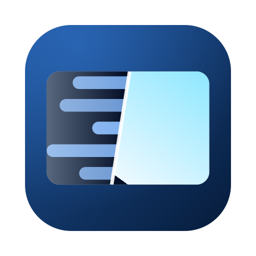

# VapourBox

A desktop app for archiving and converting video — tape captures, camcorder footage, film scans, DVDs, and the digital files you already have. Choose an output format, optionally run some cleanup, and it produces the file.

VapourBox runs [VapourSynth](https://www.vapoursynth.com/), QTGMC and FFmpeg — the tools the video archiving and restoration community already uses — without requiring you to write a script, install a plugin or open a terminal. Everything it needs is downloaded on first launch. It runs on macOS, Windows and Linux, and it's free and open source.

## What it's for

**Conversion.** Reads the DV and AVCHD files a camcorder writes, MPEG-2 from discs and set-top recorders, MXF from scanners and broadcast gear, and the ordinary MP4/MKV/AVI/MOV files you already have. Writes H.264, H.265, ProRes or lossless FFV1. It also handles the source formats that quietly defeat consumer converters — NTSC DV's 4:1:1 chroma, 4:1:0, and the 10- to 16-bit RGB and grayscale material film scans arrive in. Audio can be passed through untouched, re-encoded to AAC, Opus or FLAC, or dropped, and hardware encoders are used where the machine has them.

**Archiving.** Old footage tends to be stuck in a format that's awkward to keep: a tape capture in a codec nothing opens any more, a MiniDV file straight off the camera, a stack of DVDs, a film scan too large to keep as-is. VapourBox turns any of it into something that will still open in twenty years — FFV1 for a lossless master, or H.265 for a copy that's watchable on a phone. DVDs and `VIDEO_TS` folders are read directly, so a disc needs no separate ripping step — pick a title and it's extracted, processed and encoded in one pass. Aspect ratio is carried through correctly, including non-square pixels through a resize, which is a common way for archived video to end up the wrong shape.

**Correcting how the picture is stored.** Most consumer and broadcast video recorded before the 2010s is interlaced — VHS, Video8 and Hi8, DV camcorders, DVDs, off-air recordings — and needs converting to progressive to display properly on a modern screen. Film transferred to video was padded with pulldown instead, which can be reversed to recover the original 23.976 fps frames. VapourBox detects which case applies and handles both: QTGMC for deinterlacing, IVTC for telecined film.

**Cleanup, when the source needs it.** Twenty-one optional filters covering tape noise and smeared color, dust and scratches on scanned film, the dirty rows at the edge of a capture, ghosting from an aerial, the brightness flicker of scanned cine film, blocking from a heavily compressed disc or recorder, jagged diagonal edges, camera shake, and halos, banding and color balance. All off by default, and the presets turn on what a given kind of source actually needs.

**Subtitles.** Speech is transcribed with Whisper AI to a separate `.srt`, embedded in the output, or both.

## How it works

1. **Add the source.** Drop in a file, a folder of files, a `VIDEO_TS` folder, or open a DVD in the drive. VapourBox inspects it and reports what it found — interlaced, telecined or progressive — so the choice isn't guesswork.
2. **Set the output and any processing.** Pick a codec and container, then either start from a preset — three quality tiers, plus six named after the source, from VHS Cleanup to 8mm / Super 8 Film Scan — or switch individual filters on. Each filter's controls open in place beneath it, with a summary of what it does and when it applies.
3. **Check the preview, then run it.** The preview shows source and processed output side by side and updates as settings change, so settings can be judged before a long encode. Multiple files queue up and process unattended.

## Download

**[Latest release →](https://github.com/StuartCameronCode/VapourBox/releases/latest)**

| Platform | Minimum OS | File |
|----------|------------|------|
| macOS (Apple Silicon) | macOS 15 Sequoia | `VapourBox-x.x.x-macos-arm64.dmg` |
| macOS (Intel) | macOS 12 Monterey | `VapourBox-x.x.x-macos-x64.dmg` |
| Windows (x64) | Windows 10/11 | `VapourBox-x.x.x-windows-x64.zip` |
| Linux (x64) | glibc 2.39 (Ubuntu 24.04, Debian 13) | `VapourBox-x.x.x-linux-x64.tar.gz` |
| Linux (arm64) | glibc 2.39 (Ubuntu 24.04, Debian 13) | `VapourBox-x.x.x-linux-arm64.tar.gz` |

All processing is local. There is no account, no telemetry, and nothing is uploaded.

<b>Installing on macOS</b>

1. Download the `.dmg` matching your Mac's CPU — Apple menu → About This Mac. Apple Silicon takes `arm64` (macOS 15+), Intel takes `x64` (macOS 12+).
2. Open it and drag **VapourBox** to Applications.
3. First launch downloads its processing dependencies (~100 MB).

VapourBox is signed with an Apple Developer ID and notarized, so it opens without Gatekeeper warnings.

<b>Installing on Windows</b>

1. Download the `.zip`.
2. Extract it anywhere (e.g. `C:\VapourBox`).
3. Run `vapourbox.exe`.
4. First launch downloads its processing dependencies (~145 MB).

<b>Installing on Linux</b>

1. Download the `.tar.gz` for your architecture.
2. `tar -xzf VapourBox-x.x.x-linux-x64.tar.gz`
3. `cd VapourBox-x.x.x-linux-x64 && ./vapourbox`
4. First launch downloads its processing dependencies (~185 MB).

GPU-accelerated deinterlacing (NNEDI3CL) needs your GPU's OpenCL driver installed. Without it, VapourBox falls back to the CPU automatically.

## Output formats

| | |
|---|---|
| **Video** | H.264, H.265, ProRes, FFV1 (lossless), with hardware encoding via VideoToolbox, NVENC, Quick Sync or AMF where available |
| **Audio** | Passthrough, or re-encode to AAC, Opus or FLAC, or strip |
| **Containers** | MKV, MP4, MOV, AVI |
| **Reads** | `.dv` · `.mts` `.m2ts` (AVCHD) · `.vob` `.m2v` `.mpg` `.mpeg` · `.mxf` · `.avi` `.mov` `.mp4` `.mkv` `.ts` `.wmv` `.webm` `.flv`, plus DVD discs and `VIDEO_TS` folders |
| **Source formats** | 4:1:1 (NTSC DV), 4:1:0, 4:2:0/4:2:2/4:4:4 up to 16-bit, RGB, grayscale |
| **Colour format out** | Match the source, or convert to 4:2:0 8-bit (plays everywhere), 4:2:2 8-bit, or 4:2:2 10-bit. Worth setting for a 10-bit source: matching it produces a 10-bit file that some players and browsers refuse to open |
| **Aspect ratio** | Non-square pixels preserved through the pipeline, including through a resize; or square up anamorphic pixels, force a display aspect, or letterbox to a target size |

## The filter pipeline

Twenty-one filters, each switchable independently, applied in a fixed order. Most sources need none or a few.

| Filter | What it addresses |
|--------|-------------------|
| **Deinterlace** | Comb-like jagged edges on moving objects. QTGMC for interlaced video, IVTC to recover the original film frames from telecined DVD, or Bwdif when you want it done in a fraction of the time. |
| **Edge Repair** | The dirty rows and columns at the very edge of a tape capture — rebuilt from the picture just inside, instead of cropped away. |
| **Ghost Removal** | A faint second copy of the picture shifted sideways, left behind by an aerial or a long cable run. |
| **Deflicker** | Brightness pulsing between frames, which is what scanned cine film almost always has. |
| **DeScratch** | Vertical scratch lines on scanned film. |
| **SpotLess** | Dust, dirt and single-frame specks. |
| **Noise Reduction** | Grain and video noise across the whole frame. Motion-compensated by default; DFTTest, FFT3DFilter, TTempSmooth, FluxSmooth, STPresso and a large-window median are available under advanced options for noise the default handles badly. |
| **Chroma Denoise** | Blotchy, smeared color — common on VHS captures and old camcorder footage. Leaves luma detail untouched. |
| **Dehalo** | Bright outlines around edges, ringing, and residual ghosting left by a deinterlacer. HQDeringmod targets ringing specifically. |
| **Deblock** | Square blocking from heavy compression, and the ringing around edges that comes with it. |
| **Deband** | Visible steps in gradients and skies. |
| **Anti-Aliasing** | Stair-stepping on diagonal edges, left by deinterlacing or upscaling. Runs before sharpening, which would otherwise make the steps more visible. |
| **Stabilize** | Shake and weave — telecine wobble, jittery film scans, handheld footage. Runs last before cropping, so a small crop removes the edges it exposes. |
| **Film Grain** | Grain added back after denoising, so the picture is not left plastic — and to hide banding in skies and fades. |
| **Rotate / Flip** | Footage shot sideways, mirrored captures, scans that came off the scanner the wrong way round. |
| **Sharpen** | Soft sources needing edge and fine detail recovery. aWarpSharp2 sharpens by warping edges instead of raising contrast, so it adds no halos. |
| **Chroma Fixes** | Colour that sits sideways from the picture (corrected automatically or by hand), bleeding past edges, rainbowing and dot crawl — including the shimmering kind that only shows when the picture moves — and residual combing. Each repair has its own switch, and its settings appear only once it is on. |
| **Color Correction** | Brightness, contrast, saturation, hue, levels, white balance (warm/cool, green/magenta), and lifting detail out of the shadows of underexposed footage. Levels and white balance can each be measured automatically or set by hand. |
| **Crop & Resize** | Trimming overscan, scaling, and edge-directed upscaling. |
| **Frame Rate** | Converting between PAL and NTSC rates, for a tape that was already converted once and now plays at the wrong speed. |
| **Subtitles** | Whisper AI speech-to-text, to `.srt`, embedded, or both. |

Each filter leads with a plain-language summary and a **More** expander describing what it does and when it's the right choice, so the settings can be understood in place rather than looked up elsewhere.

The list also reacts to the file you dropped in. Filters that match what was detected in your source are marked **Suggested** with the reason — "source is hard telecine (3:2 pulldown)", "anamorphic source (10:11) — check pixel aspect" — and ones that can't apply say so, such as deinterlacing a progressive file. Nothing is switched on or off for you; detection is sometimes wrong, so it stays a hint. Filters whose problems can't be spotted from the file alone — dirt, scratches, grain, halos — say nothing either way.

Where two filters work against each other, the one that loses out says so when you open it: sharpening ahead of a denoiser that will undo it, for instance.

## Details

<b>DVDs and folders</b>

**From a disc:** insert it and click the disc icon in the toolbar, or **Open DVD** on the drop zone. VapourBox reads the disc structure and shows a title picker with duration, resolution, chapters and audio tracks. Select a title and **Add to Queue** — it's extracted to a temporary file, then analyzed and queued like any other video.

**From a ripped folder:** drag in a folder containing `VIDEO_TS`, the `VIDEO_TS` folder itself, or a flat rip — the `VIDEO_TS` contents (`VIDEO_TS.IFO`, `VTS_01_1.VOB`, …) sitting directly in a folder named after the disc. The title picker appears automatically in all three cases.

**A folder of loose files:** drag it in, or use **Open Folder** — the folder is scanned recursively and everything found is queued.

VapourBox decides between the two by looking for a DVD IFO: a folder is only treated as a disc if one is present, and a flat rip additionally needs at least one `.VOB`, so a stray `VIDEO_TS.IFO` beside ordinary videos won't divert the whole folder into the title picker.

**Encrypted discs.** Most commercial DVDs use CSS encryption. VapourBox reads discs via libdvdread, which can load libdvdcss at runtime to decrypt them, but **libdvdcss is not bundled** — install it separately if you need it. Unencrypted discs (home recordings, some independent releases) work without it.

- **macOS:** `brew install libdvdcss`
- **Windows:** download `libdvdcss-2.dll` from [VideoLAN](https://www.videolan.org/developers/libdvdcss.html) and place it next to `vapourbox.exe`
- **Linux:** `sudo apt install libdvdcss2` · `sudo dnf install libdvdcss` (RPM Fusion) · `sudo pacman -S libdvdcss`

> CSS decryption may carry legal restrictions in some jurisdictions. VapourBox does not endorse or support it; libdvdcss is a third-party library loaded automatically by libdvdread if present on the system.

<b>Preview, timeline and trimming</b>

- **Click** a thumbnail to jump to that position; **drag** to scrub.
- **Mouse wheel** zooms the timeline, centered on the cursor; **drag while zoomed** to pan.
- **Set In** / **Set Out** mark an export range so only part of the source is processed — useful for trying settings on a short section first. **Clear** removes the markers.
- Panel dividers are draggable, so the preview or the filter list can take whatever share of the window suits the job.

<b>Deinterlacing and telecine in more depth</b>

- **All 70+ QTGMC parameters** are exposed, from Draft to Placebo.
- **Higher-precision deinterlacing**, both opt-in: interlaced 4:2:0 stores chroma per field, so the pass can upsample to 4:2:2 first; separately it can run at 16-bit, avoiding rounding accumulated across QTGMC's many internal steps. Both are off by default and each states what it costs.
- **Soft telecine** pulldown flags can be stripped without re-encoding fields.
- **Edge-directed upscaling** — NNEDI3 or EEDI3 integer doubling with full neuron, quality and prescreener control, plus seven resampling kernels with per-kernel tuning.

<b>Presets</b>

Presets store the whole pipeline plus encoding settings, and the menu splits them by the question they answer.

**For Your Source** — pick the one matching what you have and you can ignore the pass list entirely: VHS Cleanup, DV Camcorder Tape, PAL DVD / Broadcast, DVD IVTC, Anime DVD, 8mm / Super 8 Film Scan.

**Quality Only** — Fast, Balanced and High Quality just deinterlace, at three levels of effort. Use one when the picture is already clean.

Your own presets save alongside them and persist across sessions.

<b>Advanced options</b>

Each filter shows a short, curated set of choices by default. **Settings → General → Show advanced options** reveals the rest — every method and every parameter, in every filter. The switch beside a filter's options does the same thing; either way it applies everywhere and is remembered.

Turning it off never changes what a filter is doing: if a preset selected an advanced method, that method stays selected and stays visible.

<b>Temporary files</b>

Scratch files — generated scripts, preview frames, job files, extracted DVD titles — go to the system temp directory. DVD extraction can need several GB, so if the system temp is on a small or slow volume it can be redirected: **Settings → General → Temporary Files**. The **✕** beside the path resets it to the default. The setting persists and applies to the next job.

## Feedback and bug reports

**Settings → General → "Report a bug or give feedback"** opens the issue tracker. Reports about specific problem sources are useful — several fixes in VapourBox came from them.

## Building from source

See [docs/BUILDING.md](docs/BUILDING.md) for build instructions, project structure and development workflow.

## License

Free software under the [GNU General Public License](LICENSE), version 3 or (at your option) any later version. Full license texts and third-party attributions are in [licenses/](licenses/).

## Author

Stuart Cameron — [stuart-cameron.com](https://stuart-cameron.com)

## Acknowledgments

- **QTGMC** by Vit, originally based on TempGaussMC_beta2 by Didée — the deinterlacing algorithm
- **VIVTC** by Fredrik Mellbin — VFM field matching and VDecimate for inverse telecine
- **VapourSynth** by Fredrik Mellbin — video processing framework
- **havsfunc**, maintained by HolyWu — the VapourSynth script library QTGMC and many other passes come from
- **MVTools** — the motion estimation QTGMC is built on; VapourSynth port by dubhater, from the AviSynth plugin by Manao with later work by Fizick, Pinterf and the SVP team
- **NNEDI3** by Kevin Stone (tritical) — the edge-directed interpolator behind QTGMC, via **znedi3** by sekrit-twc and dubhater's **nnedi3**, whose NEON kernels are what make it fast on Apple Silicon and ARM Linux
- **akarin** by Akarin, now maintained by the Jaded Encoding Thaumaturgy project — an LLVM-JIT expression evaluator. VapourSynth's own compiler for filter expressions is x86-only, so on ARM every expression was interpreted once per pixel; this is the single biggest reason Apple Silicon is now several times faster
- **fmtconv** by Firesledge (Laurent de Soras) — format conversion and resampling
- **zsmooth** by Austin Dworaczyk Wiltshire — chroma denoising (CCD, originally written by Sergey Stolyarevsky for VirtualDub) and the RemoveGrain family
- **dubhater** — a long list of VapourSynth ports this app relies on: MVTools, nnedi3, AWarpSharp2, TemporalMedian, FluxSmooth, Bifrost and the `adjust` Tweak port
- **HolyWu** — the VapourSynth ports of DFTTest, TTempSmooth, TCanny, CTMF, DCTFilter, Deblock, AddGrain, CAS, EEDI3 and NNEDI3CL
- **mawen1250** — Retinex, BM3D and mvsfunc
- **whisper.cpp** by the ggml authors — speech recognition for subtitle generation
- **libdvdread** by VideoLAN — DVD reading and navigation
- **FFmpeg** project — video encoding
- **Hybrid** by Selur — inspiration for this project

Full licence texts, copyright holders and the complete list of bundled
components are in [`licenses/NOTICES.txt`](licenses/NOTICES.txt). If any
attribution there is wrong or names you incorrectly, please
[open an issue](https://github.com/StuartCameronCode/VapourBox/issues) — it will
be fixed.

<b>Pre-built binary sources</b>

Where a component is taken pre-built rather than compiled from source, it comes
unmodified from one of these, and thanks are owed to the people who maintain
them:

- **[yuygfgg/Macos_vapoursynth_plugins](https://github.com/yuygfgg/Macos_vapoursynth_plugins)** — pre-built ARM64 VapourSynth plugins for macOS
- **[Stefan-Olt/vs-plugin-build](https://github.com/Stefan-Olt/vs-plugin-build)** — cross-platform VapourSynth plugins (arm64 + x86_64; used for `tmedian`)
- **[evermeet.cx](https://evermeet.cx/ffmpeg/)** — static x86_64 FFmpeg/FFprobe builds for the Intel macOS bundle
- **[ffmpeg.martin-riedl.de](https://ffmpeg.martin-riedl.de)** — static arm64 FFmpeg/FFprobe builds for the Apple Silicon bundle
- **[BtbN/FFmpeg-Builds](https://github.com/BtbN/FFmpeg-Builds)** — static FFmpeg/FFprobe builds for Windows and Linux
- **[python-build-standalone](https://github.com/astral-sh/python-build-standalone)** — the relocatable CPython used on macOS and Linux
- **[Homebrew](https://brew.sh)** — the `whisper-cpp` bottle used for the macOS speech-recognition add-on

The Intel (x64) bundle additionally builds its support libraries (zimg, fftw, libdvdread, boost) from source targeting **macOS 12**, so it runs on Monterey; the Apple Silicon (arm64) bundle is built for the current macOS and targets **macOS 15**.

The `akarin` plugin is the one component the Intel bundle does **not** ship: its only build targets macOS 14, which would raise the Intel floor from Monterey. Intel Macs already have VapourSynth's own x86 expression compiler, so they lose nothing by it.

