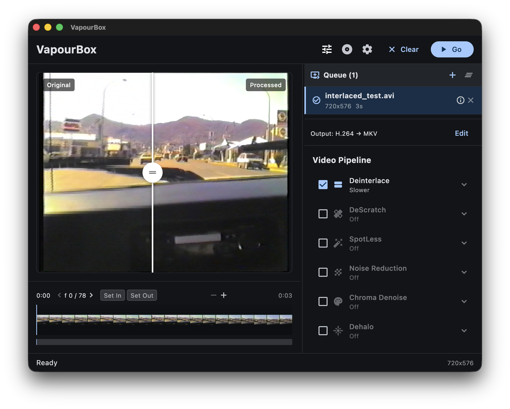

# VapourBox

A user-friendly wrapper for [VapourSynth](https://www.vapoursynth.com/) that makes video processing accessible to everyone. Convert between video formats, apply QTGMC deinterlacing, perform IVTC (inverse telecine) for DVD sources, extract DVD titles, reduce noise, generate subtitles, and fix common video problems — all through a simple drag-and-drop interface.

No scripting required. No command line needed. Just drop your video and go.



## Use Cases

- **Convert interlaced video** to progressive with high-quality QTGMC deinterlacing
- **Recover film from DVDs** with IVTC (inverse telecine) — auto-detects 3:2 pulldown
- **Clean up noisy footage** with temporal and spatial noise reduction
- **Fix compression artifacts** with deblocking and debanding filters
- **Sharpen soft video** while preserving detail
- **Generate subtitles** from speech using Whisper AI
- **Process DVDs directly** from disc — select titles, extract, deinterlace, and encode in one step
- **Import VIDEO_TS folders** from previously ripped DVDs
- **Batch-import folders** of video files
- **Archive DVDs** with proper deinterlacing/IVTC and cleanup
- **Restore VHS captures** with specialized filtering pipelines

## Download

Get the latest release for your platform:

**[Download VapourBox](https://github.com/StuartCameronCode/VapourBox/releases/latest)**

| Platform | Minimum OS | File |
|----------|------------|------|
| macOS (Apple Silicon) | macOS 15 Sequoia | `VapourBox-x.x.x-macos-arm64.dmg` |
| macOS (Intel) | macOS 12 Monterey | `VapourBox-x.x.x-macos-x64.dmg` |
| Windows (x64) | Windows 10/11 | `VapourBox-x.x.x-windows-x64.zip` |
| Linux (x64) | — | `VapourBox-x.x.x-linux-x64.tar.gz` |
| Linux (arm64) | — | `VapourBox-x.x.x-linux-arm64.tar.gz` |

> **Pick the macOS DMG that matches your Mac's CPU** (Apple menu → About This Mac). Apple Silicon Macs use the `arm64` DMG; Intel Macs use the `x64` DMG. The matching processing dependencies are downloaded automatically on first launch.
>
> The minimum macOS differs by CPU: the Intel build supports **macOS 12 (Monterey) and later**, while the Apple Silicon build requires **macOS 15 (Sequoia) or later**.

## Installation

### macOS

1. Download the `.dmg` for your Mac's CPU from the [releases page](https://github.com/StuartCameronCode/VapourBox/releases/latest) — `arm64` for Apple Silicon (macOS 15+), `x64` for Intel (macOS 12+)
2. Open the DMG and drag **VapourBox** to your Applications folder
3. On first launch, VapourBox will automatically download its processing dependencies (~180 MB)

> **Note**: VapourBox is signed with an Apple Developer ID and notarized, so it opens normally — just drag it to Applications and launch.

### Windows

1. Download the `.zip` file from the [releases page](https://github.com/StuartCameronCode/VapourBox/releases/latest)
2. Extract to a folder of your choice (e.g., `C:\VapourBox`)
3. Run `vapourbox.exe`
4. On first launch, VapourBox will automatically download its processing dependencies (~195 MB)

### Linux

1. Download the `.tar.gz` file for your architecture from the [releases page](https://github.com/StuartCameronCode/VapourBox/releases/latest)
2. Extract: `tar -xzf VapourBox-x.x.x-linux-x64.tar.gz`
3. Run: `cd VapourBox-x.x.x-linux-x64 && ./vapourbox`
4. On first launch, VapourBox will automatically download its processing dependencies (~100 MB)

> **GPU acceleration**: For GPU-accelerated deinterlacing (NNEDI3CL), install your GPU's OpenCL driver. Without it, VapourBox falls back to CPU-based processing automatically.

## Features

- **Drag-and-drop interface** — drop video files, folders, or VIDEO_TS directories to start
- **Auto-detection** — automatically identifies interlaced, telecined, and progressive content
- **Multi-pass video processing pipeline** — chain filters in order: deinterlace, denoise, dehalo, deblock, deband, sharpen, color correction, chroma fixes, crop/resize
- **Halo, ring and ghost removal** — seven methods, from DeHalo Alpha and Fine Dehalo through Edge Cleaner to Vinverse for the comb/ghost residue a deinterlacer leaves behind
- **QTGMC deinterlacing** — full access to all 70+ parameters, from Draft to Placebo quality
- **IVTC (Inverse Telecine)** — recover original 23.976 FPS film from telecined DVD sources
- **Soft telecine handling** — strip pulldown flags without re-encoding fields
- **Whisper subtitle generation** — generate SRT subtitles from speech, embed into video, or both
- **Real-time preview** — side-by-side before/after comparison with live filter updates
- **Zoomable timeline** — mouse wheel zoom centered on cursor, drag to pan
- **In/Out point markers** — export only a portion of your video
- **DVD disc import** — open a DVD, pick a title, extract and process directly
- **Batch queue** — process multiple videos with the same settings
- **Preset system** — built-in presets (Fast, Balanced, High Quality, VHS Cleanup) plus save your own
- **Multiple output formats** — H.264, H.265, ProRes, FFV1 lossless, with hardware encoding support (VideoToolbox, NVENC, QSV, AMF)
- **Audio options** — passthrough, re-encode (AAC, Opus, FLAC), or strip audio
- **Custom filters** — extend VapourBox with your own VapourSynth filters via [JSON schemas](docs/FILTER_SCHEMA.md)
- **Aspect ratio preservation** — non-square pixel SAR (e.g., anamorphic DVD) carried through the pipeline
- **Edge-directed upscaling** — NNEDI3 or EEDI3 integer doubling with the full neuron/quality/prescreener controls, plus seven resampling kernels with per-kernel tuning
- **Wide source format support** — 4:1:1 (NTSC DV), 4:1:0, 4:2:0/4:2:2/4:4:4 up to 16-bit, RGB and grayscale sources
- **Standalone** — all processing dependencies are bundled and auto-downloaded on first run

## Usage

### Basic Workflow

1. Launch VapourBox
2. Drag and drop one or more video files (or a folder, or a DVD VIDEO_TS folder)
3. Configure processing passes as needed (or use a preset)
4. Click **Go** to start processing

### DVD Import

VapourBox can extract and process titles directly from DVD discs or from previously copied VIDEO_TS folders.

**From a physical disc:**

1. Insert a DVD
2. Click the **disc icon** in the toolbar (or use the **Open DVD** button on the drop zone)
3. VapourBox reads the disc structure and shows a title picker with duration, resolution, chapters, and audio tracks
4. Select a title and click **Add to Queue**
5. The title is extracted to a temporary file, then analyzed and queued like any other video
6. Configure your processing passes and click **Go**

**From a DVD folder:**

- Drag and drop a folder containing a `VIDEO_TS` directory (or the `VIDEO_TS` folder itself)
- VapourBox detects it as a DVD and shows the title picker automatically

**From a folder of video files:**

- Drag and drop any folder, or click **Open Folder** on the drop zone
- VapourBox recursively scans for video files and adds them all to the queue

### CSS Decryption (libdvdcss)

Most commercial DVDs use CSS (Content Scramble System) encryption. VapourBox uses libdvdread for DVD access, which can load libdvdcss at runtime for decryption. **libdvdcss is not bundled with VapourBox** — if you need to read encrypted discs, install it separately.

> **Note**: CSS decryption may have legal restrictions in some jurisdictions. VapourBox does not officially endorse or support CSS decryption. libdvdcss is a third-party library that is loaded automatically by libdvdread if present on your system.

**macOS** (via [Homebrew](https://brew.sh/)):

```bash
brew install libdvdcss
```

**Windows:**

Download `libdvdcss-2.dll` from [VideoLAN](https://www.videolan.org/developers/libdvdcss.html) and place it in the VapourBox application directory (next to `vapourbox.exe`).

**Linux:**

```bash
# Debian/Ubuntu
sudo apt install libdvdcss2
# Fedora (RPM Fusion required)
sudo dnf install libdvdcss
# Arch
sudo pacman -S libdvdcss
```

Unencrypted DVDs (home recordings, some independent releases) work without libdvdcss.

### Timeline Navigation

- **Click** on thumbnails to jump to that position
- **Drag** thumbnails to scrub through video
- **Mouse wheel** to zoom in/out (centers on cursor position)
- **Drag when zoomed** to pan left/right

### In/Out Points

- Click **Set In** / **Set Out** to mark the export range
- Only frames within the range will be processed
- Click **Clear** to remove markers and export the full video

### Presets

- Click the tuning icon in the toolbar to open presets
- **Built-in**: Fast, Balanced, High Quality, VHS Cleanup
- **Save** your current settings for reuse across sessions

### Temporary Files

VapourBox writes its scratch files — generated VapourSynth scripts, preview
frames, job files and extracted DVD titles — to the system temp directory.
DVD extraction in particular can need several GB, so if your system temp lives
on a small or slow volume you can redirect it:

- **Settings → General → Temporary Files** → choose a directory
- Click the **✕** next to the path to reset it back to the system default

The setting is remembered between sessions and applies to the next job.

## Building from Source

See [docs/BUILDING.md](docs/BUILDING.md) for build instructions, project structure, and development workflow.

## Custom Filters

VapourBox supports user-defined VapourSynth filters via JSON schema files. See [docs/FILTER_SCHEMA.md](docs/FILTER_SCHEMA.md) for the full schema reference.

## License

This program is free software: you can redistribute it and/or modify it under the terms of the [GNU General Public License](LICENSE) as published by the Free Software Foundation, either version 3 of the License, or (at your option) any later version.

See the [licenses/](licenses/) directory for full license texts and third-party component attributions.

## Author

Stuart Cameron - [stuart-cameron.com](https://stuart-cameron.com)

## Acknowledgments

- **QTGMC** by Vit — the deinterlacing algorithm
- **VIVTC** by Fredrik Mellbin — VFM field matching and VDecimate for inverse telecine
- **VapourSynth** by Fredrik Mellbin — video processing framework
- **havsfunc** by HolyWu — QTGMC VapourSynth port
- **whisper.cpp** by Georgi Gerganov — speech recognition for subtitle generation
- **libdvdread** by VideoLAN — DVD reading and navigation
- **FFmpeg** project — video encoding
- **Hybrid** by Selur — inspiration for this project

### Pre-built Binary Sources

macOS plugins and binaries sourced from:
- **[yuygfgg/Macos_vapoursynth_plugins](https://github.com/yuygfgg/Macos_vapoursynth_plugins)** — pre-built ARM64 VapourSynth plugins for macOS
- **[Stefan-Olt/vs-plugin-build](https://github.com/Stefan-Olt/vs-plugin-build)** — cross-platform VapourSynth plugins (arm64 + x86_64; used for `tmedian` and `bestsource`)
- **[evermeet.cx](https://evermeet.cx/ffmpeg/)** — static x86_64 FFmpeg/FFprobe builds for the Intel macOS bundle

The Intel (x64) bundle additionally builds its support libraries (zimg, fftw, libdvdread, xz, boost) from source targeting **macOS 12**, so it runs on Monterey; the Apple Silicon (arm64) bundle is built for the current macOS and targets **macOS 15**.
